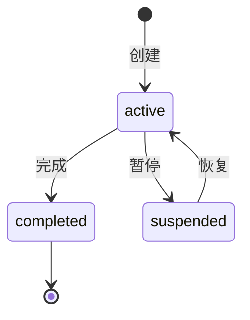
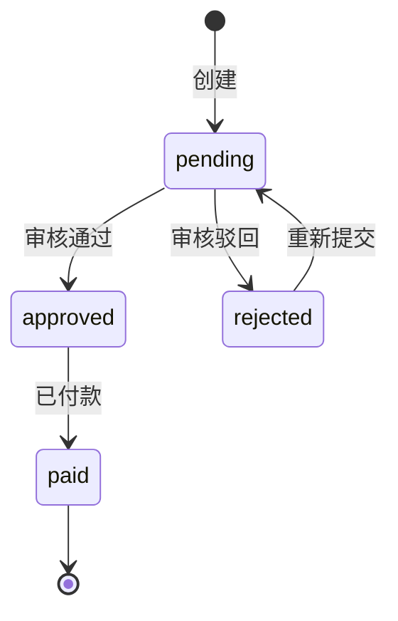
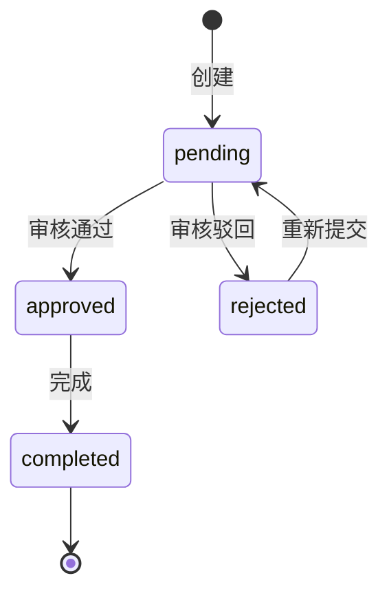
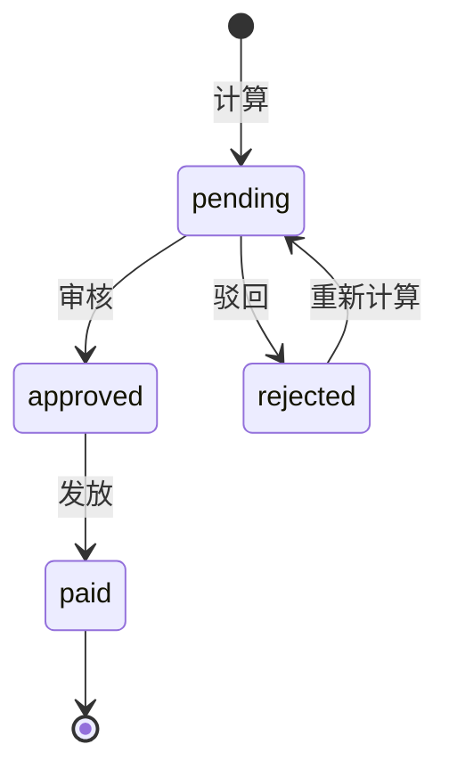

# 工程管家 数据库设计文档

> **版本**：v1.1
> **日期**：2026-06-12（首版）/ 2026-07-04（对齐当前 schema）
> **状态**：Phase 1+ 已落地（金额已迁移 INTEGER、软删除/审计字段已补齐），本文档已对齐实际 schema

---

## 0.1 业务对象清单

| 业务对象 | 对应表 | 说明 |
|----------|--------|------|
| 项目 | `projects` | 工程项目基本信息 |
| 人员(staff) | `members` | 管理人员，月薪制 |
| 工人(worker) | `workers` | 农民工，日薪制 |
| 项目工人 | `project_workers` | 工人与项目的多对多关联 |
| 项目成员 | `project_members` | 人员与项目的多对多关联 |
| 收入合同 | `income_contracts` | 项目收入合同 |
| 支出合同 | `expense_contracts` | 项目支出合同 |
| 协议合同 | `agreement_contracts` | 项目协议合同 |
| 发票 | `invoices` | 收票/开票记录 |
| 支付记录 | `payment_records` | 收付款流水 |
| 结算 | `settlements` | 项目结算办理 |
| 工资 | `wages` | 工人工资记录 |
| 考勤 | `attendances` | 人员考勤记录 |
| 成本台账 | `cost_ledger` | 真实资金流追踪 |
| 台账分类 | `cost_ledger_categories` | 成本台账分类配置 |
| 台账匹配规则 | `cost_ledger_match_rules` | 自动分类规则 |
| 库存项目 | `inventory_items` | 仓库物料 |
| 库存交易 | `inventory_transactions` | 出入库记录 |
| 材料 | `materials` | 材料信息库 |
| 合作伙伴 | `partners` | 供应商/分包商等 |
| 监管单位 | `supervisors` | 政府监管部门 |
| 部门 | `departments` | 组织架构 |
| 薪资历史 | `salary_history` | 人员薪资变更记录 |
| 工人班组 | `worker_teams` | 工人分组 |
| 模板 | `templates` | 文档模板 |
| 合同模板 | `contract_templates` | 合同专用模板 |
| 图纸 | `drawings` | 项目图纸文件 |
| 费用 | `expenses` | 项目费用记录 |
| 用户 | `users` | 系统登录用户 |
| 角色 | `roles` | 权限角色 |
| 审计日志 | `audit_logs` | 操作审计记录 |
| 快照 | `snapshots` | 数据库快照 |
| 区域 | `regions` | 省市区数据 |

---

## 0.2 关系矩阵

### 核心关系

| 主表 | 从表 | 关系类型 | 关联字段 | 说明 |
|------|------|----------|----------|------|
| projects | project_members | 1:N | project_id | 项目↔成员 |
| projects | project_workers | 1:N | project_id | 项目↔工人 |
| projects | income_contracts | 1:N | project_id | 项目↔收入合同 |
| projects | expense_contracts | 1:N | project_id | 项目↔支出合同 |
| projects | agreement_contracts | 1:N | project_id | 项目↔协议合同 |
| projects | invoices | 1:N | project_id | 项目↔发票 |
| projects | payment_records | 1:N | project_id | 项目↔支付记录 |
| projects | settlements | 1:N | project_id | 项目↔结算 |
| projects | wages | 1:N | project_id | 项目↔工资 |
| projects | cost_ledger | 1:N | project_id | 项目↔成本台账 |
| projects | drawings | 1:N | project_id | 项目↔图纸 |
| projects | expenses | 1:N | project_id | 项目↔费用 |
| projects | worker_teams | 1:N | project_id | 项目↔班组 |
| projects | materials | 1:N | (逻辑关联) | 项目↔材料 |

### 人员/工人关系

| 主表 | 从表 | 关系类型 | 关联字段 | 说明 |
|------|------|----------|----------|------|
| members | project_members | 1:N | member_id | 人员↔项目关联 |
| workers | project_workers | 1:N | worker_id | 工人↔项目关联 |
| members | wages | 1:N | member_id | 人员↔工资 |
| project_workers | wages | 1:N | project_worker_id | 项目工人↔工资 |
| members | attendances | 1:N | member_id | 人员↔考勤 |
| project_workers | attendances | 1:N | project_worker_id | 项目工人↔考勤 |
| members | salary_history | 1:N | member_id | 人员↔薪资历史 |
| departments | members | 1:N | department_id | 部门↔人员 |
| worker_teams | project_workers | 1:N | team_id | 班组↔项目工人 |

### 财务关系

| 主表 | 从表 | 关系类型 | 关联字段 | 说明 |
|------|------|----------|----------|------|
| income_contracts | invoices | 1:N | contract_id | 合同↔发票 |
| expense_contracts | invoices | 1:N | contract_id | 合同↔发票 |
| invoices | payment_records | M:N | invoice_details (JSON) | 发票↔支付(通过JSON字段) |
| invoices | settlements | M:N | invoice_details (JSON) | 发票↔结算(通过JSON字段) |
| partners | payment_records | 1:N | partner_id | 合作伙伴↔支付 |
| partners | settlements | 1:N | partner_id | 合作伙伴↔结算 |
| cost_ledger | invoices | 1:N | linked_invoice_id | 台账↔发票 |

### 其他关系

| 主表 | 从表 | 关系类型 | 关联字段 | 说明 |
|------|------|----------|----------|------|
| partners | partner_projects | 1:N | partner_id | 合作伙伴↔项目（计划拆分；当前仍为 project_ids JSON） |
| supervisors | supervisor_projects | 1:N | supervisor_id | 监管单位↔项目（计划拆分；当前仍为 project_ids JSON） |
| inventory_items | inventory_transactions | 1:N | item_id | 库存项目↔交易 |
| roles | users | 1:N | role_id | 角色↔用户 |
| regions | supervisors | 1:N | region_id | 区域↔监管单位 |

---

## 0.3 Mermaid ER 图

```mermaid
erDiagram
    projects {
        INTEGER id PK
        TEXT name
        TEXT description
        TEXT address
        TEXT start_date
        TEXT end_date
        TEXT status
        INTEGER budget
        TEXT created_at
        TEXT updated_at
    }

    members {
        INTEGER id PK
        TEXT name
        TEXT phone
        TEXT email
        TEXT member_type
        TEXT role
        TEXT id_card
        TEXT gender
        INTEGER base_salary
        INTEGER daily_wage
        TEXT entry_date
        TEXT status
        INTEGER department_id
        TEXT position
        TEXT created_at
        TEXT updated_at
    }

    workers {
        INTEGER id PK
        TEXT name
        TEXT id_card
        TEXT gender
        TEXT phone
        TEXT address
        TEXT current_address
        TEXT current_address_enc
        TEXT bank_account
        TEXT bank_name
        TEXT worker_type
        INTEGER daily_wage
        TEXT created_at
        TEXT updated_at
    }

    project_members {
        INTEGER id PK
        INTEGER project_id FK
        INTEGER member_id FK
        TEXT joined_at
    }

    project_workers {
        INTEGER id PK
        INTEGER worker_id FK
        INTEGER project_id FK
        INTEGER team_id FK
        INTEGER daily_wage
        TEXT worker_type
        TEXT entry_date
        TEXT contract_signer
        TEXT contract_start
        TEXT contract_end
        INTEGER safety_training
        TEXT work_section
        TEXT exit_date
        TEXT status
        TEXT created_at
        TEXT updated_at
    }

    income_contracts {
        INTEGER id PK
        INTEGER project_id FK
        TEXT name
        INTEGER amount
        TEXT counterparty
        TEXT sign_date
        TEXT status
        TEXT remark
        TEXT files
        TEXT created_at
        TEXT updated_at
    }

    expense_contracts {
        INTEGER id PK
        INTEGER project_id FK
        TEXT name
        INTEGER amount
        TEXT counterparty
        TEXT sign_date
        TEXT status
        TEXT remark
        TEXT files
        TEXT created_at
        TEXT updated_at
    }

    agreement_contracts {
        INTEGER id PK
        INTEGER project_id FK
        TEXT name
        INTEGER amount
        TEXT counterparty
        TEXT sign_date
        TEXT agreement_type
        TEXT status
        TEXT remark
        TEXT files
        TEXT created_at
        TEXT updated_at
    }

    invoices {
        INTEGER id PK
        INTEGER project_id FK
        INTEGER seller_id FK
        INTEGER buyer_id FK
        INTEGER contract_id FK
        TEXT type
        TEXT invoice_kind
        TEXT invoice_no
        TEXT invoice_code
        TEXT name
        INTEGER amount
        INTEGER price_amount
        INTEGER tax_amount
        REAL tax_rate
        INTEGER received_amount
        INTEGER settlement_id
        TEXT issue_date
        TEXT status
        TEXT remarks
        TEXT file_url
        TEXT created_at
        TEXT updated_at
    }

    payment_records {
        INTEGER id PK
        TEXT type
        INTEGER amount
        TEXT record_date
        INTEGER project_id FK
        INTEGER partner_id FK
        INTEGER contract_id FK
        TEXT invoice_details
        TEXT remarks
        TEXT file_url
        TEXT created_at
    }

    settlements {
        INTEGER id PK
        INTEGER project_id FK
        INTEGER partner_id FK
        TEXT name
        TEXT category
        INTEGER amount
        TEXT status
        TEXT date
        TEXT remark
        TEXT files
        TEXT invoice_details
        TEXT created_at
        TEXT updated_at
    }

    wages {
        INTEGER id PK
        INTEGER project_id FK
        INTEGER member_id FK
        INTEGER project_worker_id FK
        TEXT year_month
        INTEGER daily_wage
        REAL work_days
        INTEGER bonus
        INTEGER deduction
        INTEGER actual_wage
        INTEGER paid_amount
        TEXT paid_date
        TEXT paid_channel
        TEXT status
        TEXT created_at
        TEXT updated_at
    }

    attendances {
        INTEGER id PK
        INTEGER member_id FK
        INTEGER project_id FK
        INTEGER project_worker_id FK
        TEXT year_month
        REAL work_days
        INTEGER days_off
        INTEGER is_full_attendance
        TEXT daily_status
        INTEGER manually_edited
        TEXT file_url
        TEXT created_at
        TEXT updated_at
    }

    cost_ledger {
        INTEGER id PK
        INTEGER project_id FK
        INTEGER batch_id
        TEXT voucher_no
        TEXT date
        TEXT direction
        TEXT category
        INTEGER amount
        TEXT counterparty
        TEXT channel
        TEXT summary
        TEXT notes
        TEXT attachments
        INTEGER linked_invoice_id
        TEXT created_at
        TEXT updated_at
    }

    partners {
        INTEGER id PK
        TEXT name
        TEXT category
        TEXT contact
        TEXT phone
        TEXT email
        TEXT address
        TEXT bank_account
        TEXT bank_name
        TEXT credit_code
        TEXT tax_number
        TEXT project_ids
        TEXT created_at
        TEXT updated_at
    }

    supervisors {
        INTEGER id PK
        INTEGER region_id FK
        TEXT name
        TEXT category
        TEXT contact
        TEXT phone
        TEXT address
        TEXT project_ids
        TEXT created_at
        TEXT updated_at
    }

    departments {
        INTEGER id PK
        TEXT name
        INTEGER manager_id
        TEXT positions
        TEXT created_at
    }

    worker_teams {
        INTEGER id PK
        TEXT name
        INTEGER project_id FK
        INTEGER leader_id
        TEXT remark
        TEXT created_at
        TEXT updated_at
    }

    inventory_items {
        INTEGER id PK
        TEXT name
        TEXT category
        TEXT unit
        REAL quantity
        REAL min_quantity
        TEXT location
        TEXT notes
        TEXT created_at
        TEXT updated_at
    }

    inventory_transactions {
        INTEGER id PK
        INTEGER item_id FK
        INTEGER project_id FK
        TEXT type
        REAL quantity
        INTEGER unit_price
        TEXT date
        TEXT remark
        TEXT created_at
    }

    templates {
        INTEGER id PK
        TEXT name
        TEXT type
        TEXT category
        TEXT content
        TEXT variables
        TEXT created_at
        TEXT updated_at
    }

    users {
        TEXT id PK
        TEXT username
        TEXT password
        TEXT display_name
        TEXT role_id FK
        TEXT status
        TEXT created_at
        TEXT updated_at
    }

    roles {
        TEXT id PK
        TEXT name
        TEXT permissions
        INTEGER is_system
        TEXT created_at
    }

    audit_logs {
        INTEGER id PK
        TEXT action
        TEXT level
        TEXT user_id
        TEXT user_name
        TEXT resource
        TEXT resource_id
        TEXT details
        TEXT ip_address
        TEXT created_at
    }

    projects ||--o{ project_members : "has"
    members ||--o{ project_members : "belongs"
    projects ||--o{ project_workers : "has"
    workers ||--o{ project_workers : "belongs"
    projects ||--o{ income_contracts : "has"
    projects ||--o{ expense_contracts : "has"
    projects ||--o{ agreement_contracts : "has"
    projects ||--o{ invoices : "has"
    projects ||--o{ payment_records : "has"
    projects ||--o{ settlements : "has"
    projects ||--o{ wages : "has"
    projects ||--o{ attendances : "has"
    projects ||--o{ cost_ledger : "has"
    projects ||--o{ drawings : "has"
    projects ||--o{ expenses : "has"
    projects ||--o{ worker_teams : "has"
    members ||--o{ wages : "receives"
    project_workers ||--o{ wages : "receives"
    members ||--o{ attendances : "has"
    project_workers ||--o{ attendances : "has"
    members ||--o{ salary_history : "has"
    departments ||--o{ members : "contains"
    worker_teams ||--o{ project_workers : "contains"
    partners ||--o{ payment_records : "receives"
    partners ||--o{ settlements : "receives"
    regions ||--o{ supervisors : "contains"
    roles ||--o{ users : "assigned"
    inventory_items ||--o{ inventory_transactions : "has"
```

---

## 0.4 状态机图

### 项目状态 (projects.status)

### 发票状态 (invoices.status)

### 结算状态 (settlements.status)

### 工资状态 (wages.status)

---

## 0.5 字段规范

### 金额字段

| 规范 | 说明 |
|------|------|
| 类型 | `INTEGER`（以“分”为单位；Phase 1 已由 REAL 迁移完成，见 migration 003_MoneyRealToInteger.sql） |
| 默认值 | `DEFAULT 0` |
| 计算 | 前端显示时 ÷ 100 转换为元 |

**已迁移为 INTEGER 的金额字段（migration 003_MoneyRealToInteger.sql）**：

| 表 | 字段 |
|----|------|
| projects | budget |
| members | base_salary, daily_wage |
| workers | daily_wage |
| project_workers | daily_wage |
| income_contracts | amount |
| expense_contracts | amount |
| agreement_contracts | amount |
| invoices | amount, price_amount, tax_amount, received_amount |
| payment_records | amount |
| wages | daily_wage, bonus, deduction, actual_wage, paid_amount |
| settlements | amount |
| cost_ledger | amount |
| inventory_transactions | unit_price |
| expenses | amount |
| salary_history | base_salary, subsidy |

### 增量迁移记录

- **047_LedgerExcelBoundaryFields.sql（2026-09-02）**：attendances.manually_edited；project_workers 入库五项（contract_signer/contract_start/contract_end/safety_training/work_section）+ exit_date；workers.current_address + current_address_enc（PII 孪生列）；wages.paid_channel
- **050_AddMissingIndexes.sql（2026-09-05）**：15 条 IF NOT EXISTS 索引——project_members(project_id)、audit_logs(created_at / user_id+created_at)、invoices(contract_id/seller_id/buyer_id)、payment_records(partner_id/contract_id)、settlements(partner_id/contract_id)、cost_ledger(batch_id/linked_invoice_id)、inventory_transactions(item_id)、attendances(member_id/project_worker_id)（审计 D-08/D-09/D-10）
- **053_MoneyYuanToFen.sql（2026-09-06，原编 051 让位并行线迁移防撞号）**：金额分制贯彻——17 表 30 列历史元数据 ×100（ROUND 防丢分）；wages 带日薪 >5000 守卫（保护 v0.93+ ToFen 时代行）；app_meta 标记 money_unit=fen-053；JSON 块/税率/天数豁免；wage_history 不在列（休眠表）。此后全库金额列=分、API=元（契约见 MoneyUnit 与 CONVENTIONS 坑清单首条）

### 审计字段

| 字段 | 类型 | 说明 |
|------|------|------|
| created_at | TEXT | 创建时间，`datetime('now')` |
| updated_at | TEXT | 更新时间，需应用层维护 |

**历史上缺 updated_at、已在 Phase 2.x migration 补齐的表**（以实际 schema 为准）：
- workers
- payment_records
- cost_ledger_categories
- cost_ledger_match_rules
- inventory_transactions
- salary_history
- project_members

### 软删除字段

| 字段 | 类型 | 说明 |
|------|------|------|
| deleted_at | TEXT | NULL=正常，非NULL=已删除 |

**已在 Phase 2.x / 安全加固 migration 补齐 deleted_at 的表**：
- invoices
- payment_records
- wages
- settlements
- cost_ledger

### 状态字段约束

| 表 | 字段 | 允许值 |
|----|------|--------|
| projects | status | active, completed, suspended |
| invoices | status | pending, approved, rejected, paid |
| settlements | status | pending, approved, rejected, completed |
| wages | status | pending, approved, paid, rejected |
| income_contracts | status | draft, active, completed, terminated |
| expense_contracts | status | draft, active, completed, terminated |
| agreement_contracts | status | draft, active, completed, terminated |

---

## 0.6 反范式设计说明

| 反范式 | 表 | 说明 | 原因 |
|--------|-----|------|------|
| JSON TEXT 字段 | partners.project_ids | 项目ID列表存储为JSON | 查询频率低，避免额外关联表；（计划）Phase 2.2 拆分，当前仍为 JSON |
| JSON TEXT 字段 | supervisors.project_ids | 项目ID列表存储为JSON | 同上（计划拆分，当前仍为 JSON） |
| JSON TEXT 字段 | invoices (invoice_details in payment_records/settlements) | 发票关联信息 | 复合关联（ID+金额），JSON更灵活；Phase 2.2 拆分 |
| JSON TEXT 字段 | cost_ledger.attachments | 附件列表 | 文件引用，无需结构化查询 |
| JSON TEXT 字段 | templates/contract_templates.variables | 模板变量 | 配置数据，非查询条件 |
| TEXT 多值字段 | departments.positions | 职位列表 | （计划）Phase 2.2 拆分，当前仍为 JSON |
| 无物理外键 | 全局 | 无 FOREIGN KEY 约束 | SQLite 默认关闭外键检查，应用层保证完整性 |

---

## 待确认事项

1. **金额迁移精度**：Phase 1.3 需预检查异常精度记录
2. **JSON 字段格式**：Phase 2.2 需预检查实际数据格式（JSON数组 vs 逗号分隔）
3. **状态机完整性**：确认所有业务状态转换是否完整覆盖

---

## 验收清单

- [x] 所有当前表都有对应业务对象说明
- [x] 所有表间关系都有 1:1/1:N/M:N 标注
- [x] ER 图可直接在 Markdown 查看器中渲染
- [x] 字段规范与后续 Phase 的迁移 SQL 一致

---

**本文档已对齐 Phase 1+ 后的实际 schema；后续 schema 变更请同步更新本文件与对应 migration 脚本。**
