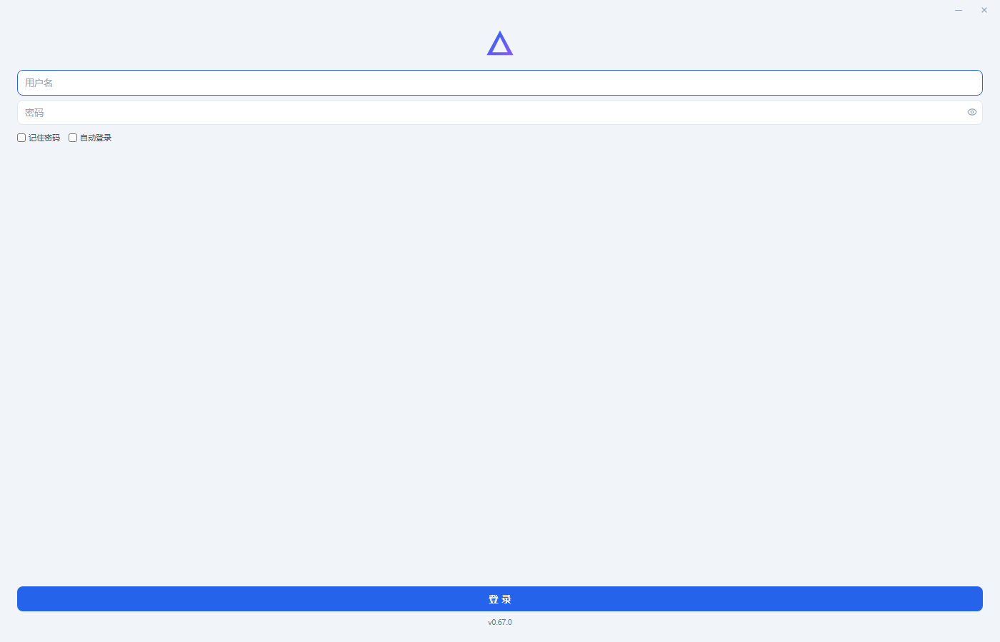

# 给自己造把锤子

我是一个有强迫症的人。

不是那种"东西摆不整齐就难受"的轻度强迫症，是那种电脑里的每一个文件夹都必须按规范命名、每一个文件都必须放在它该在的位置、桌面除了回收站什么都不能有的那种。

所以当我说我被文件夹逼疯了，你可能会觉得奇怪，你不是整理得很好吗？

是，我整理得很好。闭着眼睛我都知道每个文件在哪。

但你知道我手里有多少个项目吗？几十个。每个项目里有什么？合同、发票、台账、回单、人员信息、证书资料、标书、协议、公文、起诉函。每个都要登记，每个都要分类，每个都要归档。PDF的、Excel的、图片的，混在一起。打开这个文件夹看一眼凭证，关掉。打开那个Excel登一笔台账，关掉。再打开另一个文件夹找上个月签的那份合同。

每天就这么来回切。

我再强迫症，也扛不住这个量。

🪨

我是一个建筑公司的商务经理。说好听是商务经理，其实就是一块砖，税务、财务、法务、材料、劳资，哪里需要往哪搬。签合同的是我，开发票的是我，处理纠纷的是我，写公文的是我，登记几百个工人的身份证号和银行卡号的还是我。没有真正的上下班时间，也没有真正的放假时间，一个电话就要立刻去执行。

你可能会说，那市面上不是有很多管理软件吗？

有，但没有一个适合我。

我需要的东西很简单。我需要一个软件，能同时满足制表、附凭证和打印。交接工作的时候，能直接从软件里导出数据生成文档或表格。生成的任何东西都用统一的标准模板，不用担心文件散落。PDF、图片格式的发票能直接附在记录里，不用先转格式再手动塞进Excel。

就这么简单的需求，找不到。

我找了很久，问了很多人，也咨询过定制开发。听到报价的那一刻，我就知道了，这条路走不通。

然后今年五月，我接触到了AI。

事情是这样的。我就像平时聊天一样，把我的这些痛点说给Claude听。我跟它说，WPS里各个公司各个项目做了很多台账，发票台账、付款台账、收款台账，还有商贸公司的进销存，各种票据发票。我说我虽然能把文件夹归类好，但还是觉得太杂乱，打开这个文件夹看图片凭证，打开那个文件夹看Excel登记，打印的时候又要换一个软件，生成的东西格式还不统一。

然后Claude告诉我，它能帮我做。

说实话我当时没太当回事。AI聊天嘛，平时用豆包、用千问，也经常聊，觉得它就是个高级搜索引擎。我说行，你试试吧。

然后软件出现了。

第一版很丑，按现在的审美来说真的很丑。但它真的有合同管理、发票管理、员工管理、项目管理、仓库管理、单位管理这几个模块。页面能切换，鼠标点上去真的能响应。

我当时就愣住了。

那种感觉我不知道怎么形容。你就像跟朋友聊天一样说了一段话，然后它直接给你变出了一个软件。虽然后端通不通已不重要，但那种震撼感你知道吗？你用自然语言，它就像魔法一样，直接给你变出来了。

✨

从那天起，我就没停下来过。

到现在，这个软件已经更新到第六十七个版本了。六十七个版本。从第一版那个"一眼AI"的丑东西，到现在有启动动画、三个主题切换、圆角无边框窗口的桌面应用。

中间我换过无数个工具。Claude、Codex、MiMo、WorkBuddy，还有些别的。有的时候一个功能死活搞不定，我跟它纠缠了三天，换了无数种说法，最后换了个模型，一句话就解决了。有的时候我给AI描述需求，它完全误解了我的意思，结果做出来的东西比我想象中还要好。还有的时候，AI会反问我自己都没想到的问题，比如"你这个字段要不要支持批量导入？""你这个打印要不要加页眉页脚？"我一想，对啊，我怎么没想到。

我学会了怎么节省token，先在网页版问清楚，再回Agent端实现。我学会了怎么看报错，怎么理解"前端""后端""API"这些我以前完全不懂的东西。说真的，到现在我也不是真懂，但我能跟AI对话了，我能告诉它我想要什么，它能告诉我怎么实现。

这是一个从零开始的过程。软件从零开始，我也从零开始。

你知道那种感觉吗？就是你以前觉得完全不可能属于你的东西，突然变得可以触及了。我不会编程，各种语言、框架都不懂，真的是纯小白。但我用自然语言，AI硬生生带我从零开始。我告诉它我的痛点，它说它能办到，我根本没想到它能做到。

"一开始碰一下不会有事的"，网上有张表情包这么说。没想到我就真沉迷了。

🫠

这感觉就像中年人沉迷钓鱼、养花养鱼、盘珠子、盘核桃一样。中年总得有个爱好沉迷进去嘛。我的爱好就是每天下班回来打开电脑，跟AI聊两句，看看今天能给这个软件加点什么新功能。有时候一搞就搞到凌晨两三点，第二天还要早起去上班。

但我开心啊。

那种把脑子里的想法变成现实的感觉，太特么爽了。

然后我就开始给我朋友发。

每次更新版本，我都会马上通过微信发给几个朋友。昨天我做了一个新的启动页动画，把想要的效果用自然语言告诉AI后，它做出的效果比我预期的更棒。三个主题的适配切换，它都帮我想到了我没提到的点。我截图发给朋友，想分享这份快乐。

朋友回我一个大拇指。

或者一句"哇，好棒，厉害"。

就这样了。

人与人之间的悲欢并不相通，他感受不到这种快乐。

我理解。真的理解。

大家都有自己的事情，都很忙。特别是工程行业，没有真正的上下班时间，也没有真正的放假时间。下班回到宿舍或家里，真的不想再动弹，偶尔还要接两个工作电话，烦不胜烦。这时候让他们坐在电脑前从零开始学，确实强人所难。

而且我试过教他们。

我也想让他们用上AI工具。WorkBuddy，腾讯的，有免费额度，做轻量办公够用了。几百个工人的工资、信息台账，人工操作容易输错数字、金额、身份证号、电话号码，交给AI处理，既准确又快。起草文案、写汇报、写总结，这些场景真的好用。

但我发现我居然不知道该怎么教。

一旦涉及相关领域的单词或专业术语，他们听不懂，我也难以解释清楚。我看似比他们厉害一些，掌握了这些工具的部分使用方法，但一知半解的我，又怎么向他们阐明这些专业术语、单词、工具及使用界面呢？

甚至要安装Claude这种命令行终端形式的界面，普通员工、传统工程行业的人，第一眼就会排斥，认为自己不可能学得会。像Codex这种还要科学上网，这一步就拦住了99.9%的人。公司里那些专业能力很强、干了一辈子工程的技术总工、项目经理，他们平时能打开笔记本电脑做个表格就已经很不错了，能做个文档已经竖大拇指了。但他们的厉害之处不在办公软件上，而是在生产现场上，在专业技术上。

所以我没办法教，他们也没办法学。

我也搜过各种界面美观、操作简单、安装简便的AIGC工具，想把环境都配置好，做成一键打包的"傻瓜式"应用，让他们从最简单的开始。

但后来我放弃了。

因为我想明白了一件事。如果我帮他装好，他就没有成长了。如果他真心想好好学，这些是他必须经历的过程。如果他不愿意学这些，不愿意配置环境，也许半年后这些东西就不需要学了，因为已经被淘汰了。

说到这里，想到一个很有意思的梗。"学得越慢，等于学得越快。"

意思是什么呢？半年后开始学和半年前开始学的人，起跑线是一样的，因为之前的技术可能已经被淘汰了。以目前AI的进化速度，这还真有可能。也许一年后的学习成本和上手难度都会变得很简单，到时候就不需要懂太多东西了。

那真的就像电脑里有个贾维斯一样。

也许时间会善待所有人。

⏳

但我不后悔先走了这一步。

因为这一年，我学到的不只是怎么用AI工具。我学到的是，一个完全不懂技术的普通人，可以用自然语言，把自己脑子里的想法变成现实。以前觉得不可能的事，现在可以了。以前觉得"那是程序员才能做的事"，现在发现不是。

我的情绪是复杂的。替他们着急，又理解他们。想教他们，又知道不能追着逼。如果他们愿意问，我知无不言，愿意奉献一切。但如果他们不问，我也不会追着逼着人家。

也许我在这里记录的这些东西，某一天他们看到了，觉得有意思，愿意试一试。那就行了。

回到最开始那个问题。

四十七个项目文件夹，每个里面塞满了Excel、PDF、图片、合同扫描件。我是一个有强迫症的人，我的文件都按规范分类存放，任何一个文件我闭着眼睛都知道去哪找。

但我现在不用那样了。

因为我给自己造了一把锤子。🔨

---

以上，既然看到这里了，如果觉得不错，随手点个赞、在看、转发三连吧，如果想第一时间收到推送，也可以给我个星标⭐～

谢谢你看我的文章，我们，下次再见。

> / 作者：给自己造把锤子
